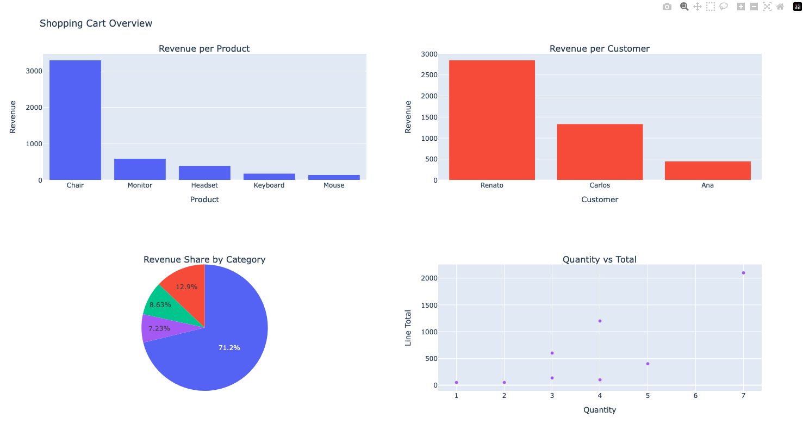

# Quick Introduction

Welcome! This is a friendly, practical intro to Python: how it runs, how to install it, and core language basics.

## What Is Python & How Does It Run Code?
Python is an interpreted programming language. That means code is not compiled **ahead of time** (like C# or Go). Instead, the Python interpreter reads and executes instructions line by line.

**Ahead of time** means there is no separate compile step that produces a final binary executable before running the program.

To run a file, use:

```bash
python3 app.py
```

Under the hood, Python:
1) parses the file
2) transforms it into bytecode (`.pyc`)
3) executes bytecode on the Python Virtual Machine (PVM)

That’s why Python is flexible and great for scripting, automation, AI, and data workflows.

## Installing Python
Official download (macOS and other OS):

- https://www.python.org/downloads/release/python-3132/

On macOS (Homebrew):

```bash
brew install python
python3 --version
```

## The Importance of Virtual Environments (`-m venv`)
Projects often need different dependency versions:

- Project A → Django 3.2
- Project B → Django 5.0

Without isolation, these can conflict. So before coding, we prepare our **project environment** to keep dependencies separated.

Create a virtual environment:

```bash
python3 -m venv .venv
```

Activate it:

```bash
source .venv/bin/activate
```

Install packages safely inside the environment:

```bash
pip install package-name
```

Example:

```bash
pip install flask
```

Deactivate any time:

```bash
deactivate
```

---

# First Code Concepts

## Variables
Python infers types automatically:

```python
age = 33
name = "Renato"
price = 19.99
```

## Constants
Python has no strict `const` keyword. Use ALL CAPS by convention:

```python
MAX_USERS = 100
APP_NAME = "Python for code lovers"
```

## Code Blocks & Indentation in Python
Many languages use braces or keywords to define blocks:

C#
```c#
if (age >= 18) {
    Console.WriteLine("Adult");
}
```

JavaScript:
```js
if (age >= 18) {
    console.log("Adult")
}
```

VB / Pascal-style:
```vb
if age >= 18 then
begin
    writeln('Adult');
end;
```

Python does not use any of these.. however!
Python Uses Indentation to Define Scope

```python
if age >= 18:
    print("Adult")
else:
    print("Minor")
```

As a result, pay attention about wrong identation.. :/

```python
if age >= 18:
print("Adult") #IndentationError: expected an indented block
```

Why Did Python Choose This Design?
Because indentation enforces:
- clean code
- consistent formatting
- readability (highly valued in Python culture)

Python follows the philosophy:
<br>
“Code is read much more often than it is written.”

Be aware!
Indentation Creates Scope for:

- if / elif / else
- for / while
- try / except / finally
- def
- class
- with

```python
for i in range(3):
    print("Loop", i)
print("Done")
```

Produces this output
```
Loop 0
Loop 1
Loop 2
Done
```

But, doing a wrong identation

```python
for i in range(3):
    print("Loop", i)
    print("Done") # here is the issue
```

The code produces this:
```
Loop 0
Done
Loop 1
Done
Loop 2
Done
```

Attention!
<br>
Python requires consistent spacing:
- Using 4 spaces is the community standard
- Tabs are discouraged
- Mixing tabs + spaces produces:

```
TabError: inconsistent use of tabs and spaces in indentation
```

Indentation Enables Expressions like this:

```python
if active:
    process()
```

or this:

```python
if user.is_admin:
    show_panel()
else:
    show_login()
```

**Therefore!**

This is not optional, it is part of the language. If we don't indent properly, our code won’t run or will behave incorrectly.

## Functions — Part 1
Define a function with `def`:

```python
def greet(name):
    return f"Hello, {name}!"
```

Call it:

```python
print(greet("Renato"))
```

### The `print()` Function

#### Simple print

```python
print("Hello")
```

#### Default and custom separators

```python
print("Renato", "Mattos", "CGI")
```

Output:

```
Renato Mattos CGI
```

```python
print("Renato", "Mattos", "CGI", sep=" | ")
```

Output:

```
Renato | Mattos | CGI
```

#### Changing line ending
Default ends with a newline:

```python
print("Hello")
print("World")
```

Output:

```
Hello
World
```

Custom ending:

```python
print("Hello", end=" ")
print("World")
```

Output:

```
Hello World
```

#### Printing to a file

```python
with open("log.txt", "w") as f:
    print("Logging something...", file=f)
```

#### Forcing immediate output with `flush`

```python
print("processing...", flush=True)
```

#### `print()` can print anything

```python
print([1, 2, 3], {"name": "Renato"}, 55.5)
```

---

## Functions — Part 2
A function can accept:

- positional parameters
- keyword parameters
- default values
- variable number of arguments

```python
def register_user(name, age=18, *skills, active=True, **metadata):
    print(name, age, skills, active, metadata)
```

Calling the function:

```python
register_user("Renato")
register_user("Renato", 35, "Python", "C#", active=False, country="Portugal")
```

**Attention:**
- `*skills` collects extra positional arguments into a tuple.
- Python is not “pass by value” or “pass by reference” in traditional terms. Variables are names pointing to objects, and functions receive references to those objects.

```python
def modify(x):
    x.append(100)

lst = [1, 2, 3]
modify(lst)
print(lst)
```

Output:

```python
[1, 2, 3, 100]
```

### Mutable vs Immutable Types (Super Important)

| Type            | Category  |
|-----------------|-----------|
| `int`           | immutable |
| `str`           | immutable |
| `tuple`         | immutable |
| `float`         | immutable |
| `list`          | mutable   |
| `dict`          | mutable   |
| `set`           | mutable   |
| objects/classes | mutable unless designed otherwise |

---

## Function Overloading (and Python’s Alternative)
Unlike C#, Java, or Go, Python doesn’t support traditional overloading like:

```c#
void do(int x)
void do(string x)
```

If we define two functions with the same name, the last one wins:

```python
def someFunc(x): print("name")
def someFunc(x): print("age")

someFunc("Renato")
```

Output:

```
age
```

### A simple alternative: default parameters

```python
def area(width, height=None):
    if height is None:
        return width * width
    return width * height

print(area(10))     # square
print(area(10, 5))  # rectangle
```

### A more powerful alternative: `singledispatch`
Python can emulate type-based dispatch at runtime:

```python
from functools import singledispatch

@singledispatch
def show(x):
    print("object:", x)

@show.register(int)
def _(x):
    print("integer:", x)

@show.register(str)
def _(x):
    print("string:", x)

show(10)
show("abc")
```

Output:

```
integer: 10
string: abc
```

If you call with an unregistered type, it falls back to the base function:

```python
show(3.14)
```

Output:

```
object: 3.14
```

Why use `singledispatch` instead of `if / elif`?

- makes code modular
- allows extension in other files/modules
- follows the OOP “open for extension” principle

---

## IF / ELIF / ELSE — Python’s Conditional Logic
In Python, conditional logic is written using:

- `if`
- `elif` (short for **else if**)
- `else`

Basic structure:

```python
if condition:
    # do something
elif other_condition:
    # do something else
else:
    # fallback
```

Example:

```python
age = 20

if age >= 18:
    print("Adult")
elif age >= 13:
    print("Teenager")
else:
    print("Child")
```

### Truthy & Falsy Values
Python evaluates values in `if` as True or False.
Examples considered **False**:

```python
0
0.0
""  # empty string
None
[]  # empty list
{}  # empty dict
False
```

Everything else is True.

```python
name = ""

if name:
    print("Has name")
else:
    print("No name")
```

Output:

```
No name
```

### Comparison Operators

| Operator | Meaning       |
|----------|---------------|
| `==`     | equal         |
| `!=`     | not equal     |
| `<`      | less than     |
| `<=`     | less or equal |
| `>`      | greater than  |
| `>=`     | greater or equal |

```python
if 10 == 10:
    print("Equal")
```

### Logical Operators

Python uses:
- `and`
- `or`
- `not`

```python
age = 25
country = "PT"

if age >= 18 and country == "PT":
    print("Can drive in Portugal")
```

### Membership Operators

```python
if "Renato" in ["Renato", "João", "Maria"]:
    print("Found")
```

---

## Looping in Python
Python has two main loops:

- `for` → iterate over items
- `while` → repeat while a condition is true

### `for` Loop — Iterates Over Items

```python
for name in ["Renato", "Ana", "João"]:
    print(name)
```

Output:

```
Renato
Ana
João
```

### Using `range()`
`range()` generates sequences of numbers:

```python
for i in range(5):
    print(i)
```

Output:

```
0
1
2
3
4
```

You can pass `start`, `end`, and `step`:

```python
for i in range(10, 0, -2):
    print(i)
```

Output:

```
10
8
6
4
2
```

### `while` Loop — Repeat Until Condition Changes

```python
count = 0

while count < 5:
    print(count)
    count += 1
```

### `break` and `continue`

| Keyword  | Meaning             |
|----------|----------------------|
| `break`  | exit loop            |
| `continue` | skip to next iteration |

Example with `break`:

```python
for i in range(10):
    if i == 3:
        break
    print(i)
```

Example with `continue`:

```python
for i in range(5):
    if i == 2:
        continue
    print(i)
```

### `else` on Loops (Python Special Feature)
Python has a unique construction that many languages don’t:

```python
for item in items:
    if condition:
        break
else:
    print("No break happened")
```

Example:

```python
for n in [1, 2, 3]:
    if n == 5:
        print("Found")
        break
else:
    print("Not found!")
```

### Best Practices for Conditionals & Loops

- Prefer `for` over `while` when iterating collections.
- Use `enumerate()` when you need the index:

```python
for i, val in enumerate(items):
    print(i, val)
```

- Use `break`/`continue` sparingly; avoid hard-to-follow nested logic.
- Avoid deeply nested conditionals (use early returns).

Example (hard to reason about):

```python
for x in matrix:
    for y in x:
        if condition1:
            break
        if condition2:
            break
        if condition3:
            continue
```

Cleaner loop pattern using `for/else`:

```python
for item in items:
    if item == target:
        print("found")
        break
else:
    print("not found")
```

---

## Looping Over Dictionaries
A dictionary (`dict`) stores key–value pairs:

```
key → value
```

Create and read values:

```python
data = {
    "name": "Renato",
    "country": "PT"
}

print(data["name"])    # Renato
print(data["country"]) # PT
```

**Attention:** if a key doesn’t exist, Python raises `KeyError`.

Looping with `items()`:

```python
data = {"name": "Renato", "country": "PT"}

for key, value in data.items():
    print(key, value)
```

`data.items()` returns key/value pairs:

```python
[("name", "Renato"), ("country", "PT")]
```

So on each iteration, Python unpacks into:
- `key`
- `value`

Output:

```
name Renato
country PT
```

More loops:

```python
for key in data.keys():
    print(key)
```

```python
for value in data.values():
    print(value)
```

Updating/removing:

```python
data["city"] = "Lisbon"      # adds

data["country"] = "Portugal" # updates

data.pop("name")             # removes
```

### Nested Dictionary Example
A dictionary can contain another dictionary:

```python
user = {
    "name": "Renato",
    "location": {
        "country": "PT",
        "city": "Lisbon"
    }
}
```

Access nested values:

```python
print(user["location"]["city"])
```

### Lists
A list is an **ordered** and **mutable** collection of items. Simple as that.

```python
fruits = ["apple", "banana", "orange"]
```

Key properties:
- Ordered
- Indexable
- Mutable (you can change it)
- Allows duplicates

Common operations: add, update, remove, and read

```python
fruits.append("kiwi")
fruits[1] = "mango"
fruits.remove("apple")
print(fruits[0])

for fruit in fruits:
    print(fruit)
```

Use a list when you need:
- ordering
- fast iteration
- dynamic resizing
- duplicates
- frequent access by index

Real-world examples:
- items in a shopping cart
- queue of tasks
- log of actions
- list of students

### Tuples
A tuple is an **ordered** and **immutable** sequence.

```python
point = (10, 20)
```

Properties:
- Ordered
- Indexable
- Immutable (cannot change after creation)
- Allows duplicates

Why immutability matters:
- data safety
- hashability (can be dict keys)
- performance optimization

```python
colors = ("red", "green", "blue")

# don't do it... tuples are immutable
colors[1] = "yellow"  # error
```

Use a tuple when you need:
- data should not change
- representing a fixed structure
- multiple return values
- used as keys in dictionaries
- performance-sensitive structures

Real-world examples:

1) Returning multiple values from a function

```python
def get_position():
    return (10, 20)

x, y = get_position()
```

2) Database row representation

```python
row = (1, "Renato", "PT")
```

### Sets
A set is an **unordered** collection of **unique** items.

```python
tags = {"python", "backend", "api"}
```

Properties:
- Unordered
- No indexing
- No duplicates
- Mutable (but elements must be hashable)

Common operations: add, read, remove

```python
tags.add("ai")
tags.add("python")  # ignored (already exists)
tags.remove("api")

for tag in tags:
    print(tag)
```

When to use sets:
- removing duplicates
- membership testing (`in`)
- mathematical operations (union, intersection)

```python
users_a = {"Renato", "Ana", "João"}
users_b = {"Ana", "Carlos"}

print(users_a & users_b)  # intersection
print(users_a | users_b)  # union
```

### Quick Comparison

| Feature            | List | Tuple | Set |
|--------------------|------|-------|-----|
| Ordered            | ✔    | ✔     | ❌  |
| Mutable            | ✔    | ❌    | ✔   |
| Allows duplicates  | ✔    | ✔     | ❌  |
| Indexable          | ✔    | ✔     | ❌  |
| Unique elements    | ❌   | ❌     | ✔   |
| Hashable           | ❌   | ✔     | ❌  |
| Best for           | dynamic sequences | fixed records | uniqueness & membership |

Before you choose, use this rule of thumb:
- If you need a sequence that changes → **List**
- If you need a fixed data structure → **Tuple**
- If you need unique items / fast membership test → **Set**

### Performance insights

```python
x in list  # O(n)
x in tuple # O(n)
x in set   # O(1) average
```

### What is OOP (Object-Oriented Programming)?
OOP is a programming paradigm built around:

- **Objects** → things with state (data) and behavior (functions)
- **Classes** → blueprints used to create objects

Real analogy:
- **Class** = recipe to build something
- **Object** = the cake itself — baked from the recipe

To create a class, we just use the `class` keyword:

```python
class MyClass:
    x = 5
```

Once we have this class, let’s create and delete an object:

```python
obj1 = MyClass()
print(obj1.x)

# deleting the object
del obj1
```

#### Initializing Objects with `__init__`
Python uses `__init__` to assign initial values:

```python
class Person:
    def __init__(self, name, age):
        self.name = name  # instance attribute
        self.age = age

p1 = Person("Renato", 35)
p2 = Person("Vanessa", 28)

print(p1.name)  # Renato
print(p2.name)  # Vanessa
```

Attention to these key concepts:
- `self` refers to the current instance
- attributes are bound to the instance

#### Adding Methods (Behavior)

```python
class Person:
    def __init__(self, name, age):
        self.name = name
        self.age = age

    def say_hello(self):
        print(f"Hi, I'm {self.name}!")

p = Person("Renato", 35)
p.say_hello()  # Hi, I'm Renato!
```

#### Instance Attributes vs Class Attributes
Instance attributes belong to each object:

```python
self.name = ...
```

Class attributes are shared by all instances:

```python
class Dog:
    species = "Canis familiaris"  # class attribute

    def __init__(self, name):
        self.name = name  # instance attribute

d1 = Dog("Rex")
d2 = Dog("Buddy")

# no instance needed to access class attributes
print(d1.species, d2.species, Dog.species)
```

#### Encapsulation (Controlled Access)
Python doesn’t enforce private members like Java/C#, but uses conventions:

| Prefix  | Meaning                       |
|---------|-------------------------------|
| `name`  | public                        |
| `_name` | protected (internal use)      |
| `__name` | name mangling (harder to access) |

```python
class BankAccount:
    def __init__(self, balance):
        self.__balance = balance  # "private"

    def get_balance(self):
        return self.__balance

ba = BankAccount(100)
print(ba.get_balance())  # 100
print(ba.__balance)  # AttributeError
```

#### Inheritance (Reusing Behavior)
`Dog` inherits from `Animal` and overrides `speak()`.
Override means the behavior changes from parent class to the child one.

```python
class Animal:
    def speak(self):
        print("some sound")

class Dog(Animal):
    def speak(self):
        print("woof!")

a = Animal()
d = Dog()

a.speak()  # some sound
d.speak()  # woof!
```

#### Polymorphism
With polymorphism, different classes respond to the same method name:

```python
class Cat:
    def speak(self):
        print("meow")

class Dog:
    def speak(self):
        print("woof")

animals = [Cat(), Dog()]

for a in animals:
    a.speak()
```

Output:

```
meow
woof
```

#### Composition (Objects Inside Objects)

```python
class Engine:
    def start(self):
        print("engine on")

class Car:
    def __init__(self):
        self.engine = Engine()  # composed

my_car = Car()
# using my_car object we can access engine and call start()
my_car.engine.start()  # engine on
```

#### Special Methods
Python allows customizing built-in behavior:

| Method     | Purpose           |
|------------|-------------------|
| `__init__` | constructor       |
| `__str__`  | printable string  |
| `__len__`  | length            |
| `__eq__`   | equality          |
| `__repr__` | developer string  |

```python
class Person:
    def __init__(self, name):
        self.name = name

    def __str__(self):
        return f"Person: {self.name}"

print(Person("Renato"))  # Person: Renato
```

#### Abstract Base Classes (ABCs)
To enforce an interface-like contract, Python provides:

```python
from abc import ABC, abstractmethod

class Animal(ABC):
    @abstractmethod
    def speak(self):
        pass

# Concrete classes must implement "speak"
class Dog(Animal):
    def speak(self):
        print("woof")

```

In case the contract class miss implementing the mandatory method

```python

class Cat(Animal):
    pass

```

BANG!

TypeError: Can't instantiate abstract class Cat with abstract method speak

Are you curious about "pass"?

pass is a no-op statement in Python, meaning “Do nothing here.”

Python requires indentation blocks after constructs like:
- class
- def
- if
- for
- while
- try

So if you don't have any code yet, you must write something to keep the syntax valid.


#### OOP Concept Summary
- Encapsulation → control access
- Inheritance → reuse & extend
- Polymorphism → same method, different behavior
- Abstraction → hide complexity
- Composition → build by combining objects

Use classes when:
- modeling real-world entities
- grouping data + behavior
- building large systems
- using frameworks (Flask, Django, FastAPI)
- implementing design patterns
- writing libraries

Don’t over-engineer. For simple scripting, something like this is fine:

```python
class Calculator:
    def add(self, a, b):
        return a + b

# Functional style is fine :)
def add(a, b):
    return a + b
```

#### Mini Real-World Example

```python
class Order:
    def __init__(self, customer, items):
        self.customer = customer
        self.items = items

    def total(self):
        return sum(item["price"] for item in self.items)

order = Order(
    customer="Renato",
    items=[
        {"name": "Keyboard", "price": 50},
        {"name": "Mouse", "price": 30}
    ]
)

print(order.total())
```

## 🐼 Pandas! What It Is and How to Use It
Thi is a Python library for working with structured data, especially:
- tables
- spreadsheets
- CSV files
- SQL query results
- time series
- analytics data

Why people love Pandas:
- It feels like Excel + SQL + Python combined
- Fast filtering, grouping, and aggregations
- Great for data cleaning and exploration
- Works seamlessly with CSV/Excel/SQL sources

Blending these items, we have:
```
Excel + SQL + Python = Pandas
```

Using pandas we have two main data types:
- Series → 1D labeled data
- DataFrame → 2D table data (like an Excel sheet)


**Installing Pandas**
```
pip install pandas
```

**Core operations you will use all the time**
- Preview: `df.head()` / `df.tail()`
- Shape: `df.shape`
- Column types: `df.dtypes`
- Summary stats: `df.describe()`
- Sort: `df.sort_values("column")`
- Missing values: `df.isna().sum()` and `df.fillna(0)`

### Creating a DataFrame

```python
import pandas as pd

data = {
    "name": ["Renato", "Ana", "Carlos"],
    "age": [35, 28, 40],
    "country": ["PT", "BR", "US"]
}

df = pd.DataFrame(data)
print(df)
```

with this output

```
     name  age country
0  Renato   35      PT
1     Ana   28      BR
2  Carlos   40      US
```

### Reading Real Data (CSV / Excel / SQL)**

```python
# reading from CSV file
df = pd.read_csv("users.csv")

# reading from Excel
df = pd.read_excel("orders.xlsx")

# FROM SQL ouput
df = pd.read_sql("SELECT * FROM orders", connection)
```

WoW! This makes Pandas a glue layer between systems.

Once we have the DataFrame, we can filter content like SQL.
For instance, applying a filter to fetch data where `age > 30`

```python
import pandas as pd

data = {
    "name": ["Renato", "Ana", "Carlos"],
    "age": [35, 28, 40],
    "country": ["PT", "BR", "US"]
}

df = pd.DataFrame(data)

filtered = df[df["age"] > 30]

print(filtered)
```

the output is

```
     name  age country
0  Renato   35      PT
2  Carlos   40      US
```

But if we just need some specific columns?

```python
# do this for a single column
df["name"]

# or multiple
df[["name", "country"]]
```

Something like this

```python
import pandas as pd

data = {
    "name": ["Renato", "Ana", "Carlos"],
    "age": [35, 28, 40],
    "country": ["PT", "BR", "US"]
}

df = pd.DataFrame(data)

filtered = df[df["age"] > 30]

print(filtered[["name", "country"]])
```

which procudes this

```
     name country
0  Renato      PT
2  Carlos      US
```

**Let´s Grouping and Aggregating**
if you have already played with `Group By` in `SQL`, this is very similar
The code below groups the content by the `country` field and calculates the average of the values in each group

```python
df.groupby("country")["age"].mean()
```

Let´s see the whole code in action

```python
import pandas as pd

data = {
    "name": ["Renato", "Ana", "Carlos"],
    "age": [32, 28, 40],
    "country": ["PT", "BR", "PT"]
}

df = pd.DataFrame(data)

avgResult = df.groupby("country")["age"].mean()

print(avgResult)
```

with this output

```
country
BR    28.0
PT    36.0

Name: age, dtype: float64
```

We can also apply functions and much more

```python
df["group"] = df["age"].apply(lambda x: "adult" if x >= 18 else "minor")
```

Let´s verify the whole code once more

```python
import pandas as pd

data = {
    "name": ["Renato", "Ana", "Carlos", "Pedro"],
    "age": [32, 28, 40, 15],
    "country": ["PT", "BR", "PT", "Es"]
}

df = pd.DataFrame(data)

# df.apply() allows us to apply a function to each row or each column of a DataFrame.
# where 
# axis=0 → apply to columns
# axis=0 → apply to columns
result = df.apply(
    # lambda row creates an anonymous function that receives a row
    # using this inline IF condition
    # ("adult" if row['age'] >= 18 else "minor")
    lambda row: f"{row['name']} ({row['age']}) is an " + ("adult" if row['age'] >= 18 else "minor"),
    axis=1
)

# in this sample we used axis=1 that means:
# For each row in the DataFrame, execute this function once.
print(result)
```

with this output

```python
0    Renato (32) is an adult
1       Ana (28) is an adult
2    Carlos (40) is an adult
3     Pedro (15) is an minor
```

we can also run the function adding a new column to the output, for instance, adding a classification column name

```python
import pandas as pd

data = {
    "name": ["Renato", "Ana", "Carlos", "Pedro"],
    "age": [32, 28, 40, 15],
    "country": ["PT", "BR", "PT", "Es"]
}

df = pd.DataFrame(data)

df["classification"] = df["age"].apply(lambda x: "adult" if x >= 18 else "minor")

print(df)
```

with this output

```python
     name  age country classification
0  Renato   32      PT          adult
1     Ana   28      BR          adult
2  Carlos   40      PT          adult
3   Pedro   15      Es          minor
```

We have played with mean function.. however we have much more.. you just need to try them:

| Function   | Description         |
|------------|---------------------|
| `.sum()`   | total               |
| `.mean()`  | average             |
| `.min()`   | minimum             |
| `.max()`   | maximum             |
| `.count()` | count rows          |
| `.nunique()`| count unique values |
| `.median()`| median              |
| `.std()`   | standard deviation  |


Something like
```python
df.groupby("country")["age"].max()
df.groupby("country")["age"].count()
```

#### Running our samples
1. into the folder py-from-zero-to-hero-00 we have added a file name `requirements.txt`in order to centralize our external dependencies.
2. build a local env named samples using the command line below

```
python3.11 -m venv samples
```

3. activate this env using

```
source samples/bin/activate
```

4. install the dependencies mentioned into requirements.txt file using

```
pip install -r ./requirements.txt
```

4. run the first demo app using

```
python3.11 ./src/dataframe01.py
```

this produces this output

```python
=== BASIC AGGREGATIONS ===
Total revenue:          4635.0
Average line total:     579.375
Min line total:         50.0
Max line total:         2100.0
Std deviation:          728.7780256801694

=== DISTINCT / UNIQUE VALUES ===
Unique products:         ['Keyboard' 'Mouse' 'Monitor' 'Headset' 'Chair']
Number of products:      5

=== GROUP BY CUSTOMER ===
             sum   mean    min     max  count         std
customer                                                 
Ana        450.0  225.0   50.0   400.0      2  247.487373
Carlos    1335.0  667.5  135.0  1200.0      2  753.068722
Renato    2850.0  712.5   50.0  2100.0      4  957.753448

=== GROUP BY CUSTOMER + CATEGORY ===
                         sum    mean     min     max  count
customer category                                          
Ana      Audio         400.0   400.0   400.0   400.0      1
         Peripherals    50.0    50.0    50.0    50.0      1
Carlos   Furniture    1200.0  1200.0  1200.0  1200.0      1
         Peripherals   135.0   135.0   135.0   135.0      1
Renato   Furniture    2100.0  2100.0  2100.0  2100.0      1
         Monitor       600.0   600.0   600.0   600.0      1
         Peripherals   150.0    75.0    50.0   100.0      2

=== PRODUCT LEVEL STATS ===
          total_revenue  avg_unit_price  times_sold  distinct_customers
product                                                                
Chair            3300.0           300.0           2                   2
Headset           400.0            80.0           1                   1
Keyboard          185.0            47.5           2                   2
Monitor           600.0           200.0           1                   1
Mouse             150.0            25.0           2                   2

=== SUMMARY OF AGGREGATION FUNCTIONS ===
sum      4635.000000
mean      579.375000
min        50.000000
max      2100.000000
count       8.000000
std       728.778026
Name: total, dtype: float64

Distinct products:       5
Product list:            ['Keyboard', 'Mouse', 'Monitor', 'Headset', 'Chair']
```

Try other samples

## Building charts using plotly library
Plotly's Python graphing library makes interactive, publication-quality graphs. 
https://plotly.com/python/

Why Plotly?
- Interactive charts (zoom, hover, filter)
- Works in notebooks, scripts, and web apps
- Easy export to HTML or images

**Installing Plotly**
```
pip install plotly
```

**Basic example**
```python
import plotly.express as px

df = px.data.iris()
fig = px.scatter(df, x="sepal_width", y="sepal_length", color="species")
fig.show()
```

**Save an interactive chart to HTML**
```python
fig.write_html("chart.html")
```

In the next example (plotly02.py), we use Pandas together with Plotly to visualize a shopping cart dataset. The script is located in the src folder, and the code is straightforward and well-documented.

Let´s run it

```
cd py-from-zero-to-hero-00
python3.11 -m venv samples
source samples/bin/activate
pip install -r ./requirements.txt
python3.11 ./src/plotly02.py
```




## Coming next

- packages
- Many files
