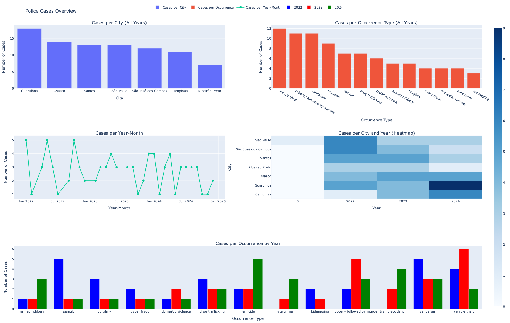

## Context

Classify police case reports based on unstructured text. From each document we needed to extract key pieces of information:  city, district, year, month, and the type of occurrence (hate crime, robbery followed by murder, traffic accident, femicide, etc.). These insights need to be aggregated month by month  to measure government performance and analyze trends in crime reduction across the state. 

# Running the project

```
python3.11 -m venv challenge
source challenge/bin/activate
pip install -r ./requirements.txt
python3.11 ./src/phase01.py
```


