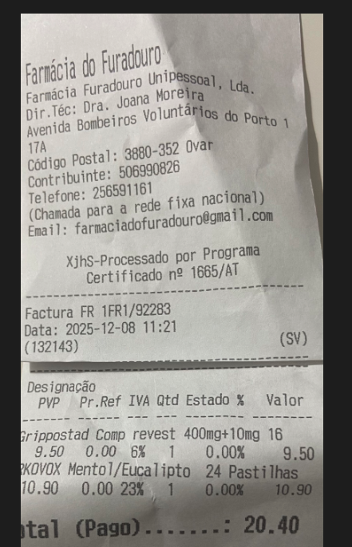

# Challenge Overview: Automated Document Extraction

The goal of this challenge is to implement an automated pipeline capable of extracting structured information from real-world documents using a local LLM (via Ollama).

The pipeline must:
- Accept images as input
- Process them through OCR
- Leverage an LLM to produce a normalized JSON array containing every relevant field and value present in the document

## Isn’t It Overkill to Add an LLM If OCR Can Handle This?

A traditional OCR library will only extract raw text from the image. This library doesn’t understand the structure, semantic meaning, or intent behind the content. For example, OCR doesn’t know whether `22,04€` refers to a unit price, a tax amount, a discount, a subtotal, or the final total. It also won’t normalize field names, separate line items, infer document type, or produce machine-readable output.

In our case, we are combining two steps:
- OCR → converts the image to plain text
- Agent/LLM → interprets that text and transforms it into structured JSON fields

The agent layer is doing the heavy lifting:
- Identifying field boundaries
- Classifying information
- Normalizing field names
- Dealing with noise
- Extracting nested values (e.g., items, dates, totals)
- Outputting a predictable JSON schema

Here’s why OCR alone isn’t enough:
- OCR output is usually noisy, fragmented, or non-linear
- Invoices differ wildly between vendors
- Multiple layouts, languages, tax systems, and fonts
- Signal-to-noise is high (headers, disclaimers, footnotes, coupons, ads, legal text)
- No “field” notion (OCR just dumps characters)

For example, given this OCR result:

```text
SUPERMERCADOS A
FS AAP204/026754
Chocolate Pintarolas 8x220
€ 22,04
poupança 6%
Total € 23,36
```

A human can easily identify these fields:
- `store_name = Supermercados A`
- `invoice_number = FS AAP204/026754`
- `item_name = Chocolate Pintarolas`
- `quantity = 8x220`
- `total_amount = 23.36`
- `discount = 6%`

But OCR libraries do not do that.

Our pipeline converts this into something structured, like:

```json
{
  "store_name": "Supermercados A",
  "invoice_number": "FS AAP204/026754",
  "items": [
    {
      "product_name": "Chocolate Pintarolas",
      "quantity": "8x220",
      "unit_price": "22.04",
      "discount": "6%"
    }
  ],
  "total_amount": "23.36"
}
```

## Document Types

For the challenge, consider at least three document categories:
1. Supermarket invoice
2. Gas station receipt
3. Medical consultation receipt

Each document may vary in:
- Layout
- Formatting
- Field naming
- Language
- Abbreviations
- Structure

## Input Format

The input to the system will be an image file, such as:
- `.png`
- `.jpg`
- `.jpeg`
- `.pdf` (single page)

## LLM Extraction Requirement

The LLM will receive the raw OCR text and must output a structured response formatted as:

```json
[
  { "field": "field_name", "value": "field_content" }
]
```

## Example Expected Output

A supermarket invoice might produce output such as:

```json
[
  { "field": "store_name", "value": "Supermarket XPTO" },
  { "field": "contribuinte", "value": "500997833" },
  { "field": "issue_date", "value": "2026-01-28" },
  { "field": "item_name_1", "value": "Rice 5kg" },
  { "field": "item_price_1", "value": "25.90" },
  { "field": "item_name_2", "value": "Beans 1kg" },
  { "field": "item_price_2", "value": "8.50" },
  { "field": "total_amount", "value": "34.40" },
  { "field": "payment_method", "value": "Credit Card" }
]
```

A gas station receipt might instead contain:

```json
[
  { "field": "station_name", "value": "PetroFuel" },
  { "field": "fuel_type", "value": "Gasoline" },
  { "field": "liters", "value": "35.20" },
  { "field": "unit_price", "value": "1.65" },
  { "field": "total_amount", "value": "58.08" },
  { "field": "issue_date", "value": "2026-01-28" }
]
```

## Success Criteria

The challenge is considered successful if:
1. All document types produce JSON arrays
2. No relevant fields are lost
3. No malformed JSON is returned
4. The system runs offline (local OCR + local LLM)
5. Output remains consistent across document variations

## Installing OS Tools

macOS:
```bash
brew install tesseract
```

Linux: 
```bash
sudo apt-get install tesseract-ocr
```


## Running the App

```bash
python3.11 -m venv challenge
source challenge/bin/activate
pip install -r ./requirements.txt
python3.11 ./src/phase01.py
```



## JSON output

```json
{
  "IMG_9294.png": {
    "ocr_text": "ria do Fran\n\nFarmacia Fura\npir. lec:\navenida Bombe 110\n\n‘eI -352 OV )\nCédigo Postal: 3880-94 i\nContribuinte: 506990826 A\n\nTelefone: 956591161 as\n(Chanada para a rede f1x@ nacional)\n\nEmail: ‘armaciadofuradourcégma || COM\n\nxjhS-Processado por Prograila\nCertificado n? 1665/A1\n\nFactura FR 1FR1/92283\n\nData: 2025-12-08 11:21\n\n(132143) (SV)\n\n| Sees sS see\n\nDesignacao\npyp......",
    "fields": [
      {
        "field": "store_name",
        "value": "Farmacia Fura"
      },
      {
        "field": "street",
        "value": "avenida Bombe 110"
      },
      {
        "field": "postal_code",
        "value": "3880-94 i"
      },
      {
        "field": "owner",
        "value": "506990826"
      },
      {
        "field": "phone_number",
        "value": "956591161"
      },
      {
        "field": "email_address",
        "value": "armaciadofuradourcégma || COM"
      },
      {
        "field": "processed_by",
        "value": "Prograila"
      },
      {
        "field": "certificate_number",
        "value": "1665/A1"
      },
      ....
    ]
  },
  "IMG_9295.png": {
    "ocr_text": "CNT Ovar\nsMEPCADOS 5.A.\nMODE TNENTE HIPERMERCADOS | A\nRUA JOAG, MEARE, N 505 4464-503 SENHOR\n\nHORA 475\n% Registad y sob n 502011\nNe P1004 147510, 9: 40% 627.000, 001EUR\nProdutor En. proi102979; EEE PT000291;\nOL PTOSOD282. pA PrOB000504; P.....",
    "fields": [
      {
        "field": "address",
        "value": "Rua Joago, Meare, nº 505, 4464-503 Senhor"
      },
      {
        "field": "store_name",
        "value": "Hipermercados TNENTE HIPERMERCADOS A"
      },
      {
        "field": "issue_date",
        "value": "2026-01-28T10:30"
      },
      .......
      
```

# Running the second app objects.py
Run Docker Ollama (port 11435):
```bash
docker run -d --name ollama \
  -p 11435:11434 \
  --network=backend-bridge-network \
  -v ollama:/root/.ollama \
  --cpus="4.0" \
  --memory="8g" \
  -e OLLAMA_NUM_PARALLEL=1 \
  -e OLLAMA_NUM_THREADS=4 \
  ollama/ollama
```

Pull the `llama3.2` model:
```bash
docker exec -it ollama bash
ollama pull llava:7b
```

Confirm the model was pulled:
```bash
docker exec -it ollama bash
ollama list
```

docker exec -it <container_id> /bin/bash
ollama pull llava

docker ps
CONTAINER ID   IMAGE           COMMAND               CREATED      STATUS       PORTS                                             NAMES
c31b611ee2b5   ollama/ollama   "/bin/ollama serve"   5 days ago   Up 6 hours   0.0.0.0:11435->11434/tcp, [::]:11435->11434/tcp   ollama
(challenge) renatomatos@PT-D144L6PXF0 python-adventure % docker exec -it ollama /bin/bash


root@c31b611ee2b5:/# ollama pull llava
pulling manifest 
pulling 170370233dd5: 100% ▕████████████████████████████████████████████████████████████████████████████████████████████████▏ 4.1 GB                         
pulling 72d6f08a42f6: 100% ▕████████████████████████████████████████████████████████████████████████████████████████████████▏ 624 MB                         
pulling 43070e2d4e53: 100% ▕████████████████████████████████████████████████████████████████████████████████████████████████▏  11 KB                         
pulling c43332387573: 100% ▕████████████████████████████████████████████████████████████████████████████████████████████████▏   67 B                         
pulling ed11eda7790d: 100% ▕████████████████████████████████████████████████████████████████████████████████████████████████▏   30 B                         
pulling 7c658f9561e5: 100% ▕████████████████████████████████████████████████████████████████████████████████████████████████▏  564 B                         
verifying sha256 digest 
writing manifest 
success 

ollama list
NAME               ID              SIZE      MODIFIED       
llava:latest       8dd30f6b0cb1    4.7 GB    13 minutes ago    
llama3.2:latest    a80c4f17acd5    2.0 GB    7 days ago   

lets validate ollama api is ok
curl http://localhost:11435/api/tags
{"models":[{"name":"llava:latest","model":"llava:latest","modified_at":"2026-01-27T15:59:45.933695009Z","size":4733363377,"digest":"8dd30f6b0cb19f555f2c7a7ebda861449ea2cc76bf1f44e262931f45fc81d081","details":{"parent_model":"","format":"gguf","family":"llama","families":["llama","clip"],"parameter_size":"7B","quantization_level":"Q4_0"}},{"name":"llama3.2:latest","model":"llama3.2:latest","modified_at":"2026-01-20T14:57:16.960827012Z","size":2019393189,"digest":"a80c4f17acd55265feec403c7aef86be0c25983ab279d83f3bcd3abbcb5b8b72","details":{"parent_model":"","format":"gguf","family":"llama","families":["llama"],"parameter_size":"3.2B","quantization_level":"Q4_K_M"}}]}%                               

```bash
python3.11 -m venv challenge
source challenge/bin/activate
pip install -r ./requirements.txt
python3.11 ./src/objects.py
```