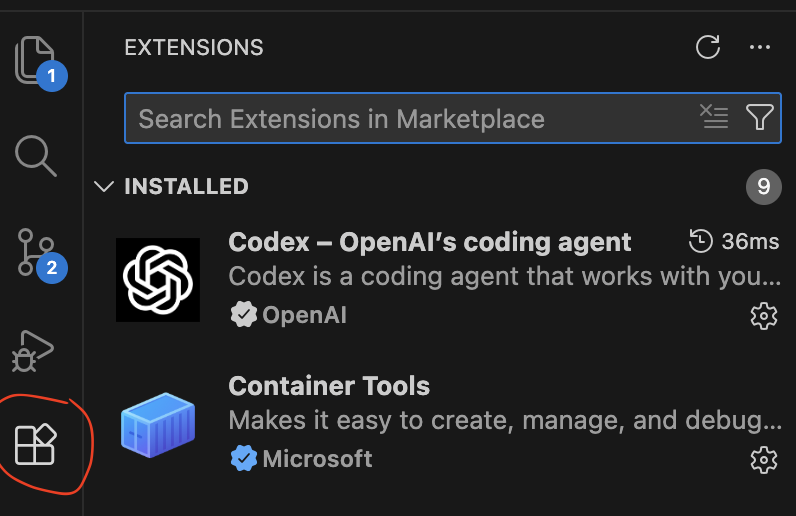
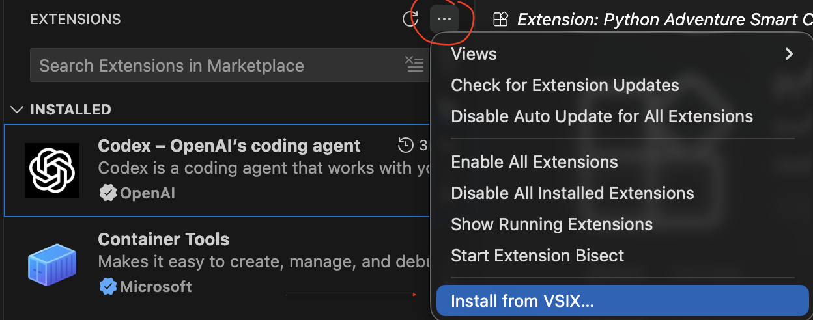
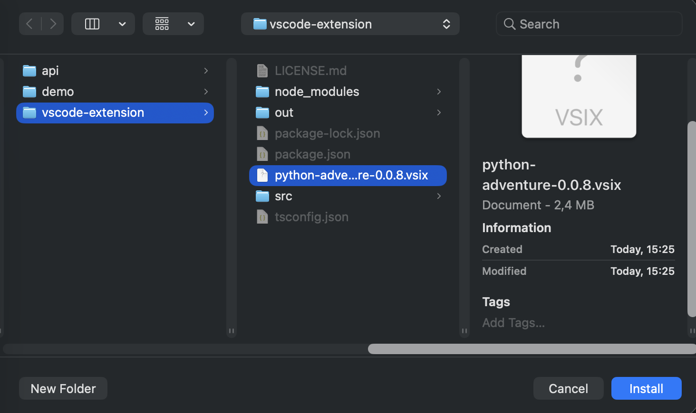
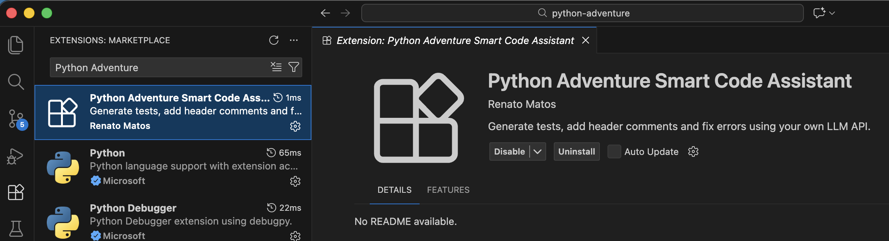
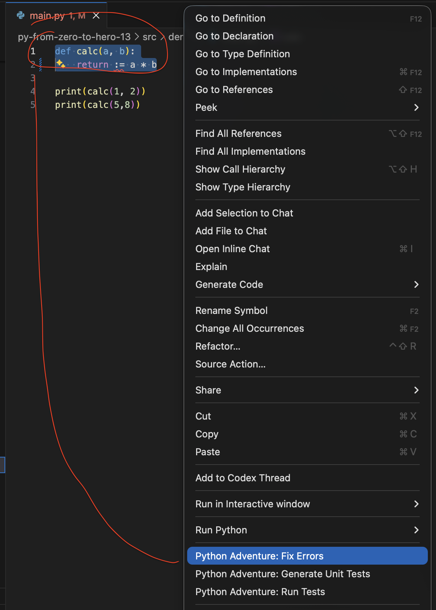
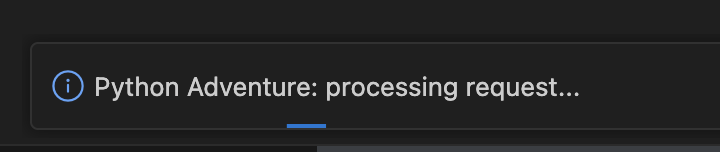
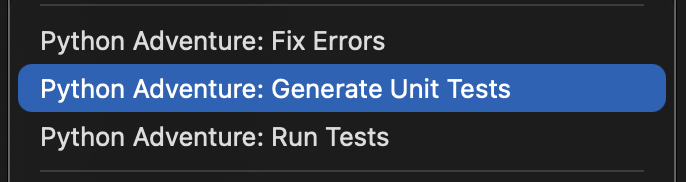
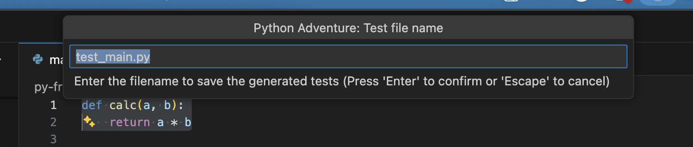
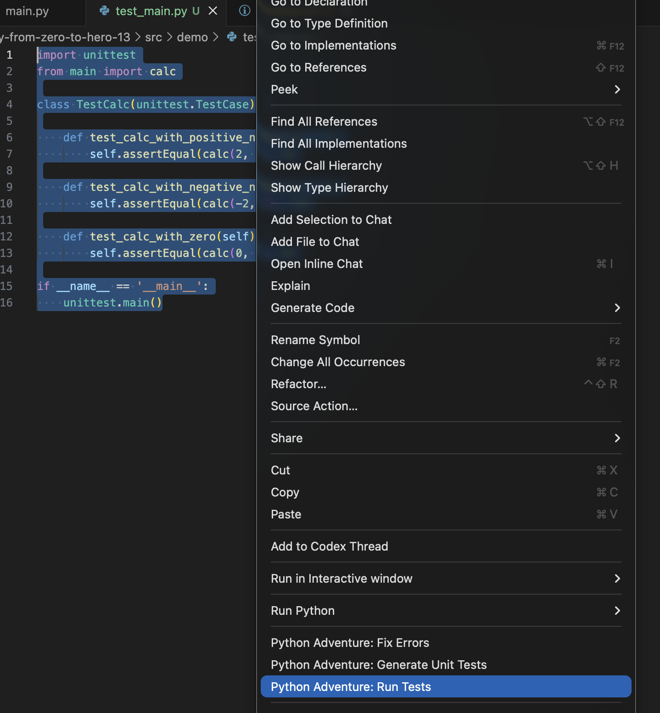
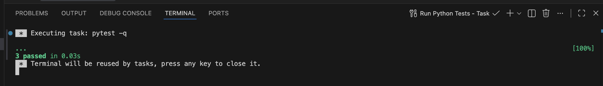

# Challenge Overview: Buil a custom VS Code Extension using Ollama with qwen2.5-coder Model
This challenge explores how to integrate local LLM capabilities directly into the development workflow by building a custom VS Code Extension that communicates with a custom Python API powered by Ollama and the qwen2.5-coder model. The goal is to enhance code editing productivity without relying on cloud-based LLM services.

## Objectives
The challenge consists of three core objectives:
VS Code Extension Development (TypeScript)
Create a custom extension using the VS Code Extension SDK to:
interact with user code selections
trigger context menu commands
communicate with an external API
write new files dynamically (e.g., generated test files)
update the current document programmatically
Local LLM Execution with Ollama
Use Ollama running locally to avoid network dependency and ensure full customization:
load and run the qwen2.5-coder model
handle developer tasks such as:
fixing compilation/runtime errors
adding header documentation comments
generating test files
Custom Backend API (Python + Flask/FastAPI)
Implement a lightweight Python backend exposing a single /analyze endpoint that:
receives code, language, and task instructions from the extension
formats prompts for the model
returns structured JSON responses

## Key Features Completed in This Challenge
During the build phase, the following features were implemented:
✔ Local execution using Ollama + qwen2.5-coder
✔ Custom /analyze API with structured tasks
✔ VS Code right-click context menu commands
✔ Code-driven transformations:
Fix Errors
Generate Unit Tests
Add Header Comments
✔ Test generation workflow that prompts for output file name
✔ Integration with VS Code’s file system APIs
✔ Progress notifications (Processing request…)
✔ .vsix packaging for installation & distribution
✔ Versioned build pipeline using npm run build
✔ Optional Dockerization for the Python backend
✔ Ability to run fully offline

## Comparison Table (Claude and Something like Claude - Claude-like :)
Feature	Claude	Best local equivalents
General reasoning	Opus	DeepSeek-R1
Developer tasks	Sonnet	Qwen 2.5 Coder
Balanced chat	Sonnet	Llama-3.1
Fast chat	Haiku	Mistral Nemo
Safety	Very high	Medium
Context window	Very large	Small–medium

## Project struct
```bash
py-from-zero-to-hero-13/
  src/
    api/
      main.py
      requirements.txt
    vscode-extension/
      LICENSE.md
      package.json
      tsconfig.json
      src/
        extension.ts
```

## Firsr of all - Lets run the API

Run Docker Ollama (port 11435):
```bash
docker run -d --name ollama \
  -p 11435:11434 \
  --network=backend-bridge-network \
  -v ollama:/root/.ollama \
  --cpus="4.0" \
  --memory="8g" \
  -e OLLAMA_NUM_PARALLEL=1 \
  -e OLLAMA_NUM_THREADS=4 \
  ollama/ollama
```

Pull the `qwen2.5-coder` model:
```bash
docker exec -it ollama bash
ollama pull qwen2.5-coder
```

Example output:
```text
root@9a9337640a8a:/# ollama pull qwen2.5-coder
pulling manifest 
pulling 60e05f210007: 100% ▕██████████████████████████████████████████████████████████▏ 4.7 GB                         
pulling 66b9ea09bd5b: 100% ▕██████████████████████████████████████████████████████████▏   68 B                         
pulling 1e65450c3067: 100% ▕██████████████████████████████████████████████████████████▏ 1.6 KB                         
pulling 832dd9e00a68: 100% ▕██████████████████████████████████████████████████████████▏  11 KB                         
pulling d9bb33f27869: 100% ▕██████████████████████████████████████████████████████████▏  487 B                         
verifying sha256 digest 
writing manifest 
success 
```

Check the model list:
```bash
ollama list
```

The output must contains `llava:7b` model

```bash
NAME                    ID              SIZE      MODIFIED           
qwen2.5-coder:latest    dae161e27b0e    4.7 GB    About a minute ago (\0/)
```

Lets confirm Ollama is ready to play using:
```bash
curl http://localhost:11435/api/tags
```

```bash
{"models":[{"name":"llava:latest","model":"llava:latest","modified_at":"2026-01-27T15:59:45.933695009Z","size":4733363377,"digest":"8dd30f6b0cb19f555f2c7a7ebda861449ea2cc76bf1f44e262931f45fc81d081","details":{"parent_model":"","format":"gguf","family":"llama","families":["llama","clip"],"parameter_size":"7B","quantization_level":"Q4_0"}},{"name":"llama3.2:latest","model":"llama3.2:latest","modified_at":"2026-01-20T14:57:16.960827012Z","size":2019393189,"digest":"a80c4f17acd55265feec403c7aef86be0c25983ab279d83f3bcd3abbcb5b8b72","details":{"parent_model":"","format":"gguf","family":"llama","families":["llama"],"parameter_size":"3.2B","quantization_level":"Q4_K_M"}}]}%                               
```

Lets set some env variables 

```bash
export OLLAMA_URL=http://localhost:11435
export OLLAMA_MODEL=qwen2.5-coder
```

Once requirements are set, lets run the API:

```bash
cd py-from-zero-to-hero-13
python3.11 -m venv vscodext
source vscodext/bin/activate
pip install -r ./src/api/requirements.txt
cd ./src/api
uvicorn main:app --reload --host 0.0.0.0 --port 8000
```

The output should be:

```bash
INFO:     Will watch for changes in these directories: ['/Users/renatomatos/Desktop/projects/python-adventure/py-from-zero-to-hero-13/src/api']
INFO:     Uvicorn running on http://0.0.0.0:8000 (Press CTRL+C to quit)
INFO:     Started reloader process [59364] using WatchFiles
INFO:     Started server process [59366]
INFO:     Waiting for application startup.
INFO:     Application startup complete.
```

Our api must be available

```bash
curl http://localhost:8000/ping
```

with this output

```json
{"status":"ok"}
```

Validating our LLM

```bash
curl -X POST "http://localhost:8000/analyze" \
  -H "Content-Type: application/json" \
  -d '{
    "task": "fix_errors",
    "language": "python",
    "code": "pint(x)"
  }'
```

with this output

```json
{"updated_code":"```python\nprint(x)\n```","notes":"Task 'fix_errors' applied by LLM."}
```

## Builkding the VS Code Extension

Installing nodejs

```bash
brew install node
```

Lets confirm everything is ok

```bash
node -v
v25.5.0

npm -11.8.0
11.8.0
```

Installing project dependencies

```bash
 cd py-from-zero-to-hero-13/src/vscode-extension
 npm install
```

Compile and build the extension


```bash
 cd py-from-zero-to-hero-13/src/vscode-extension
npm run build
```

this this expected output:

```bash
> python-adventure@0.0.8 build
> npm run compile && vsce package


> python-adventure@0.0.8 compile
> tsc -p ./

(node:73026) [DEP0040] DeprecationWarning: The `punycode` module is deprecated. Please use a userland alternative instead.
(Use `node --trace-deprecation ...` to show where the warning was created)
Executing prepublish script 'npm run vscode:prepublish'...
(node:73026) [DEP0190] DeprecationWarning: Passing args to a child process with shell option true can lead to security vulnerabilities, as the arguments are not escaped, only concatenated.

> python-adventure@0.0.8 vscode:prepublish
> npm run compile


> python-adventure@0.0.8 compile
> tsc -p ./

This extension consists of 523 files, out of which 150 are JavaScript files. For performance reasons, you should bundle your extension: https://aka.ms/vscode-bundle-extension . You should also exclude unnecessary files by adding them to your .vscodeignore: https://aka.ms/vscode-vscodeignore
 DONE  Packaged: /Users/renatomatos/Desktop/projects/python-adventure/py-from-zero-to-hero-13/src/vscode-extension/python-adventure-0.0.8.vsix (523 files, 2.33MB)
```

Here we have the extension vsix file

```bash
...
DONE  Packaged: /Users/renatomatos/Desktop/projects/python-adventure/py-from-zero-to-hero-13/src/vscode-extension/python-adventure-0.0.8.vsix (523 files, 2.33MB)
```

### Lets install this extention
Please, open the extension panel


Browse the vsix file


From vscode-extension folder, select the vsix file and click on the Blue Install button


Once the extension is available let´s test it


Into the demo folder, open the main.py file
Select the invalid function block
```python
def calc(a, b):
    return := a * b
```

Keep these two lines selected, using the options mouse button, clik on Python Adventure: Fix Errors


At the right botton, we have a progress information


We can also verify this request usinng the terminal from our alive api

(vscodext) renatomatos@PT-D144L6PXF0 api % uvicorn main:app --reload --host 0.0.0.0 --port 8000
```bash
INFO:     Will watch for changes in these directories: ['/Users/renatomatos/Desktop/projects/python-adventure/py-from-zero-to-hero-13/src/api']
INFO:     Uvicorn running on http://0.0.0.0:8000 (Press CTRL+C to quit)
INFO:     Started reloader process [74063] using WatchFiles
INFO:     Started server process [74065]
INFO:     Waiting for application startup.
INFO:     Application startup complete.
```

API response
```bash
[OLLAMA] URL: http://localhost:11435, model: qwen2.5-coder
[OLLAMA] Status: 200
[OLLAMA] Body: {"model":"qwen2.5-coder","created_at":"2026-01-28T15:41:56.376718502Z","message":{"role":"assistant","content":"```python\ndef calc(a, b):\n    return a * b\n```"},"done":true,"done_reason":"stop","total_duration":1745098209,"load_duration":106029792,"prompt_eval_count":101,"prompt_eval_duration":512736875,"eval_count":17,"eval_duration":1109351749}
INFO:     127.0.0.1:59211 - "POST /analyze HTTP/1.1" 200 OK
```

So then, the code must be fixed
before:
```python
def calc(a, b):
    return := a * b
```

after:
```python
def calc(a, b):
    return a * b
```

So now, lets build the test file for this piece of code

Select the function body 
```python
def calc(a, b):
    return a * b
```

and click on Python Adventure - Generate Unit Tests


once we have the request completed, we have a dropdown with the suggestion output test file name


just press return, open the test file test_main.py and fix the import adding a reference to the calc function
oringinal test file content
```python
import unittest

class TestCalc(unittest.TestCase):

    def test_calc_with_positive_numbers(self):
        self.assertEqual(calc(2, 3), 6)

    def test_calc_with_negative_numbers(self):
        self.assertEqual(calc(-2, 3), -6)

    def test_calc_with_zero(self):
        self.assertEqual(calc(0, 5), 0)

if __name__ == '__main__':
    unittest.main()
```

lest fix it, importing calc function

```python
import unittest
from main import calc
```

Run these tests using Python Adventure: Run Tests menu item


We should see this terminal ourtput window
