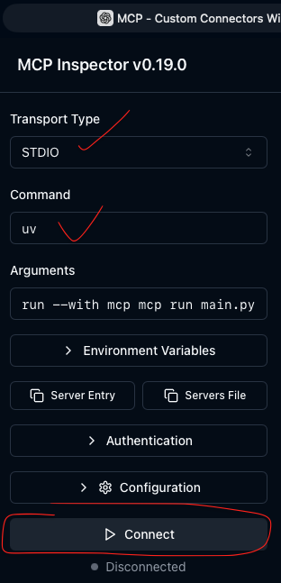
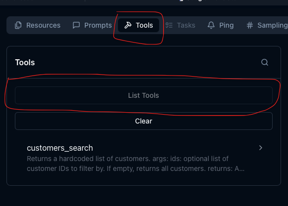
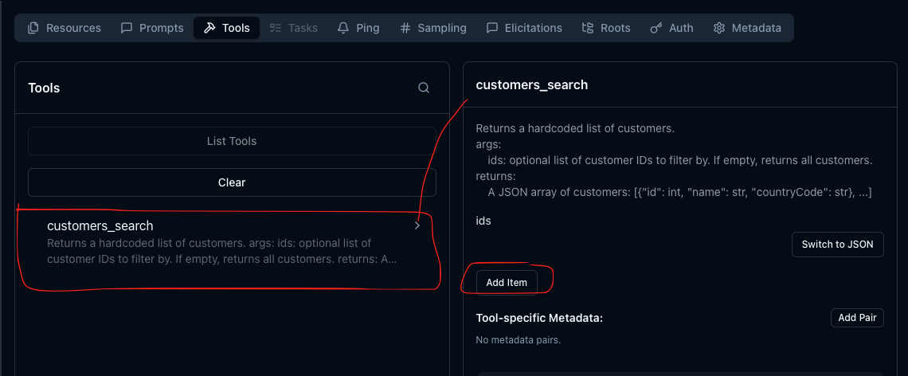
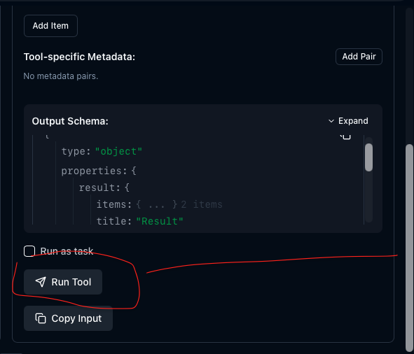
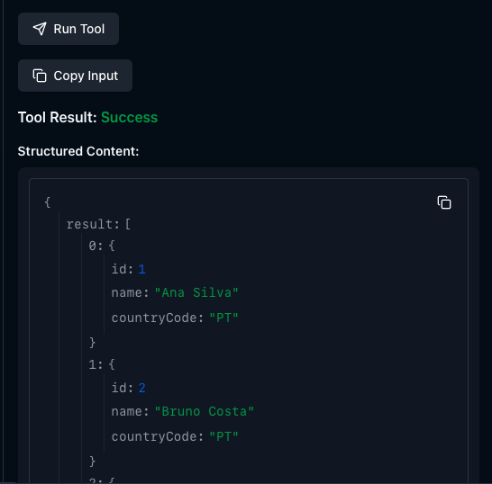
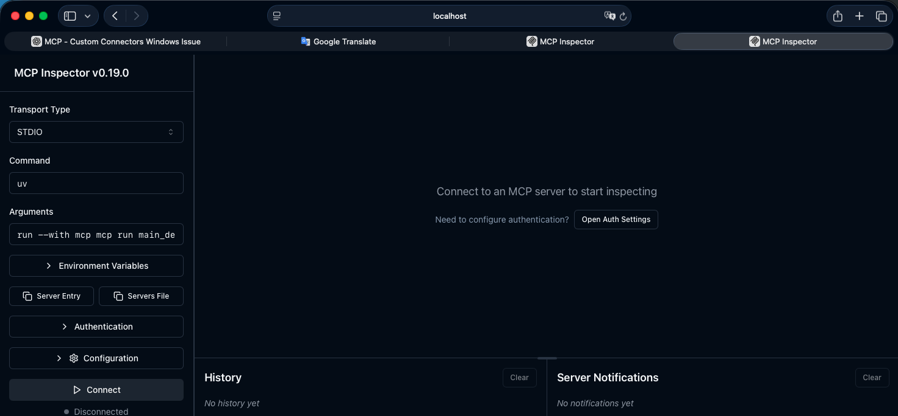
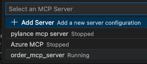
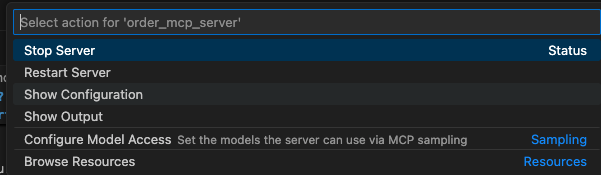
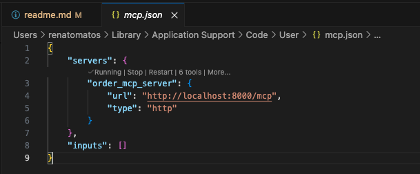
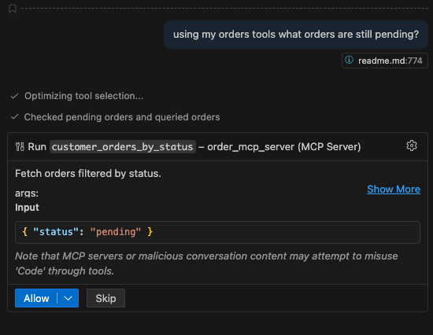

# Are you still using `pip`? Move to `uv`

Docs: https://docs.astral.sh/uv/

## Comparisons

### `uv` vs `nvm` (Node Version Manager)

**Similarities**
- Manages language versions
- Lets install multiple versions
- Lets projects pin a version

**Differences**
- `nvm` only manages Node versions.
- `uv` also manages packages, tools, virtual environments, and lockfiles.

### `uv` vs `pip`

**Similarities**
- Installs Python packages
- Reads `requirements.txt`

**Differences**
- `uv` is much faster.
- `uv` also handles Python versions and lockfiles.
- `pip` alone cannot manage Python versions or tools.

### `uv` vs `pipx`

**Similarities**
- Installs CLI tools globally
- Isolates tools

**Differences**
- `pipx` only installs tools.
- `uv` installs tools and project dependencies (and Python itself).

### `uv` vs Poetry / Pipenv

**Similarities**
- Uses `pyproject.toml`
- Generates lockfiles
- Manages virtual environments
- Handles dependencies per project

**Differences**
- `uv` is significantly faster.
- `uv` also manages Python versions and tools.
- Poetry/Pipenv usually do not manage Python installations themselves.

### `uv` vs the Java ecosystem

| Java tool | Similar `uv` capability |
| --- | --- |
| SDKMAN | `uv python install` (manage language versions) |
| Maven / Gradle | `uv add`, `uv lock`, `pyproject.toml` (dependency mgmt) |
| jEnv | `uv python pin` (project version pinning) |

`uv` merges SDKMAN + Maven + pipx into one CLI.

### One-sentence summary

Are you still getting confused “What is `uv`?”

> `uv` is an all-in-one Python environment manager — like `nvm` + `pip` + `pipx` + Poetry combined, but faster.

### Python world before `uv`

```
pyenv     -> Python versions
pip       -> packages
pipx      -> tools
venv      -> environments
poetry    -> lockfiles/projects
```

Python world with `uv`

```
uv -> everything above
```

## Installing `uv` (Windows)

```bash
# Open Windows Power Shell and Run the below command
powershell -ExecutionPolicy ByPass -c "irm https://astral.sh/uv/install.ps1 | iex"

# Using winget
winget install --id=astral-sh.uv  -e

# Using scoop
scoop install main/uv
```

## Installing `uv` (Linux)

```bash
# Using curl
curl -LsSf https://astral.sh/uv/install.sh | sh

# using wget
wget -qO- https://astral.sh/uv/install.sh | sh

# Add to path
export PATH="$HOME/.cargo/bin:$PATH"
```

## Installing `uv` (macOS)

```bash
curl -LsSf https://astral.sh/uv/install.sh | sh

# confirm uv is properly installed
uv --version
# uv 0.9.27 (b5797b2ab 2026-01-26)
```

## Managing Python versions

```bash
# install the latest Python version
uv python install

# install a specific version
uv python install 3.12

# uninstall a specific version
uv python uninstall 3.11

# set a specific Python version for a given project
# run this command inside the project folder
uv python pin 3.12

# which version am I using?
uv run python --version
# Python 3.14.2

# already installed versions
uv python list --only-installed
# cpython-3.14.2-macos-aarch64-none     .local/bin/python3.14 -> .local/share/uv/python/cpython-3.14.2-macos-aarch64-none/bin/python3.14
# cpython-3.14.2-macos-aarch64-none     .local/share/uv/python/cpython-3.14.2-macos-aarch64-none/bin/python3.14
# cpython-3.11.14-macos-aarch64-none    /opt/homebrew/bin/python3.11 -> ../Cellar/python@3.11/3.11.14_1/bin/python3.11
# cpython-3.9.6-macos-aarch64-none      /usr/bin/python3

# available versions to install, including old patch versions
uv python list --all-versions
# cpython-3.15.0a5-macos-aarch64-none                 <download available>
# cpython-3.15.0a5+freethreaded-macos-aarch64-none    <download available>
# cpython-3.14.2-macos-aarch64-none                   .local/bin/python3.14 -> .local/share/uv/python/cpython-3.14.2-macos-aarch64-none/bin/python3.14
# cpython-3.14.2-macos-aarch64-none                   .local/share/uv/python/cpython-3.14.2-macos-aarch64-none/bin/python3.14
# cpython-3.14.2+freethreaded-macos-aarch64-none      <download available>
# ...
```

## Initialize a new project

```bash
# init creates a new project directory
uv init playground
cd playground
ls -la
# .python-version     # sets the project version (pin)
# README.md           # doc file
# main.py             # basic file structure
# pyproject.toml      # package dependencies (like requirements.txt when using pip)

# add a new package
# when adding a package using uv we do not need to activate the .venv
# this is automatically done when using uv inside the project directory
uv add requests

# .venv is auto-created
ls -la
# .python-version
# .venv               # built internally by uv
# README.md
# main.py
# pyproject.toml
# uv.lock             # current installed package versions

# add a specific package version
uv add "fastapi>=0.110"

# view pyproject.toml
cat pyproject.toml
# [project]
# name = "playground"                         # project name
# version = "0.1.0"                           # project version
# description = "Add your description here"
# readme = "README.md"
# requires-python = ">=3.14"                  # current python version
# dependencies = [                            # our two dependencies
#     "fastapi>=0.110",
#     "requests>=2.32.5",
# ]

# when pyproject.toml is not in sync with uv.lock, sync it using
uv sync
# Resolved 15 packages in 11ms
# Audited 14 packages in 2ms

# if lock file is missing, add it using
uv lock

# run the project
uv run python main.py
# Hello from playground!
```

## Adding tools (like `pipx` or Node's `nvm`)

```bash
# run a tool without installing it
uvx ruff check .

# list installed tools
uv tool list
# No tools installed

# install ruff
# tools installed with `uv tool install` are NOT project dependencies
# therefore, they do not go into `pyproject.toml`
uv tool install ruff

# tie the tool to the project (like a dev dependency in npm)
uv add --dev ruff
# Resolved 16 packages in 195ms
# Prepared 1 package in 387ms
# Installed 1 package in 3ms
#  + ruff==0.14.14

# see the dev dependency in pyproject.toml
cat pyproject.toml
# ...
# [dependency-groups]
# dev = [
#     "ruff>=0.14.14",
# ]

# list installed tools (once more)
uv tool list
# ruff v0.14.14
# - ruff

# remove ruff
uv tool uninstall ruff
```

## MCP (Model Context Protocol) brief introduction

Before diving into the code, there are a few MCP concepts to get straight:
- MCP Server (a toolbox or capability provider)
- MCP Client (protocol translator)
- Protocols
- Mental Model
- Host

To make this concrete, we will build a toolbox and connect it with Microsoft Copilot.

If we want to go deeper, here is the official MCP repo:
- https://github.com/modelcontextprotocol

## MCP Server
An MCP Server is not a physical host or machine. It is an application we build and control that exposes capabilities to AI assistants.

In the chain, the MCP Server is the most important piece:
- It owns the tools, data, and logic.
- It´s similar to a microservice, API backend, or plugin server.

**Important:** 

The interface that allows the communication between server and client is standardized by MCP, not by REST or gRPC.

**What it contains**
- Tools (functions the AI can call)
- Resources (readable data)
- Prompts (predefined system instructions)
- Business logic
- Databases, APIs, files, etc.

For this challenge, our MCP Server provides tools like:
- customers_search
- customers_get_by_id
- customers_search_by_names
- customer_orders_by_status
- orders_get_by_status
- orders_get_by_customer_id

How communication works: it talks MCP over a transport such as:
- stdio (local process)
- HTTP (localhost:8000/mcp)
- WebSockets, etc.

## MCP Client (polyglot protocol translator)
The MCP Client is a software layer that understands MCP and knows how to:
- discover tools
- call tools
- send requests
- receive responses
- handle streaming, errors, etc.

Do we need to implement the protocol ourselves? No. It is embedded inside tools like:
- VS Code Copilot
- Claude Desktop
- Cline
- Continue
- MCP Inspector

Into the plauground folder, our MCP server is using these two clients:

- VS Code Copilot
- MCP Inspector (used to validate our tool)

**Analogy:** 

If we consider MCP like HTTP. So, then:
- MCP Server = backend API
- MCP Client = Postman / fetch library / HTTP client

## Tools - "The verbs of the system"
Tools are functions exposed by the MCP server that the AI can call. A tool is not:
- the host
- the client
- the LLM

Tools are capabilities: "something the AI can ask our server to do."

In our challenge, tools are like methods/endpoints with this following notation:

```python
@mcp.tool()
def customers_search(ids: List[int] = []) -> List[Dict]:
```

Each tool has:
- a name
- a description
- an input schema
- an output

So, tools are the verbs the AI can perform in your system.

| Tool | What it lets the AI do |
| --- | --- |
| customers_search | Read customers |
| customers_get_by_id | Fetch one customer |
| customers_search_by_names | Search by name |
| customer_orders_by_status | Fetch orders |

## Host "Where the AI lives and runs"
Hosts are not physical machines or servers. A host is the application that runs the LLM and decides when to use tools.

Examples:
- VS Code Copilot Chat
- Claude Desktop
- Cursor
- Cline
- Continue
- MCP Inspector

So, what does a host really do?
- embeds the MCP Client
- embeds an LLM (Claude, GPT, Copilot, etc.)
- decides how the user interacts with tools

## What MCP transports actually are
A "transport" is how messages travel between client and server.

### Transport 1 - STDIO (standard input/output)
This is a good choice for local processes. The MCP server is launched locally, and communication happens over:
- stdin
- stdout

No HTTP, no ports, no URLs.

Is there someone using this? Yeah, we have:
- Claude Desktop (when triggering local tools)
- Many CLI-based MCP tools
- Some VS Code extensions

Instead of a URL, the host runs something like:

```python
python my_mcp_server.py
```

When should we use STDIO?
- Same machine as the host
- No network access needed
- We want simplicity and speed
- No authentication or ports
- Local dev tools / personal automation / desktop integrations

**Pros**
- Very reliable locally
- No CORS, TLS, or firewall
- Easy for dev tools

**Cons**
- Cannot work across machines
- Hard to run in cloud containers for multiple users
- Harder to scale or share

### Transport 2 - Streamable HTTP (recommended modern transport)
We will use this transport via:

```python
http://localhost:8000/mcp
```

This is a single HTTP endpoint that behaves like a long-lived stream of messages between client and server:
- HTTP-based
- Bidirectional
- Streaming-friendly

When should we use Streamable HTTP?
- MCP server runs in Docker (what we built here! Really? Yeah, I give my word )
- We want to deploy it
- Multiple hosts need access
- We want cloud access
- We need real security (TLS, OAuth, API keys, etc.)
- Team-shared MCP servers
- Production systems
- Company tools

**Pros**
- Great for containers and microservices
- Works behind reverse proxies
- Works over the internet
- Scales well
- Plays nicely with Kubernetes, AWS, Azure, etc.

**Cons**
- We still may need: CORS, authentication, HTTPS, proper streaming config

### Transport 3 - SSE (Server-Sent Events)
This is legacy and being phased out; it is being replaced by Streamable HTTP.

### How everything works together (full flow)
1. A user types a message in VS Code Copilot Chat: "Get all pending orders and summarize by customer."
2. The Host reads the message and asks the LLM what to do.
3. The LLM thinks: "I need to call a tool."
4. The Host uses its MCP Client to call our tool:

```python
customer_orders_by_status(status="pending")
```

5. Our MCP Server executes the function and returns JSON.
6. The MCP Client sends the result back to the Host.
7. The LLM processes the result and gives a final answer in plain English.

## Time to Code - Let us Start Our Playground

Need that "muscle" icon \0/

First, create a new project:

```bash
uv init playground
cd playground
uv add "fastmcp<3"
uv add "mcp[cli]>=1.26.0"
uv add "tool>=0.8.0"
```

Now we will expose a simple tool to the model. The idea is a hardcoded customer dataset that can later be replaced by a database query. Replace the contents of `main.py` with the code below:

```python
from mcp.server.fastmcp import FastMCP
from typing import List, Dict

# creates our "order_server" MCP server
mcp = FastMCP("order_server")

# --------------------------
# Hardcoded customers dataset
# --------------------------
CUSTOMERS: List[Dict[str, object]] = [
    {"id": 1, "name": "Ana Silva", "countryCode": "PT"},
    {"id": 2, "name": "Bruno Costa", "countryCode": "PT"},
    {"id": 3, "name": "Carla Souza", "countryCode": "BR"},
    {"id": 4, "name": "Diego Santos", "countryCode": "BR"},
    {"id": 5, "name": "Emma Johnson", "countryCode": "US"},
    {"id": 6, "name": "Frank Miller", "countryCode": "US"},
    {"id": 7, "name": "Giulia Rossi", "countryCode": "IT"},
    {"id": 8, "name": "Hiro Tanaka", "countryCode": "JP"},
    {"id": 9, "name": "Ines Almeida", "countryCode": "PT"},
    {"id": 10, "name": "Juan Perez", "countryCode": "ES"},
]

# search customers (filter by ids) and returns a collection (list of dictionaries)
@mcp.tool()
def customers_search(ids: List[int] = []) -> List[Dict[str, object]]:
    """Returns a hardcoded list of customers.
    args:
        ids: optional list of customer IDs to filter by. If empty, returns all customers.
    returns:
        A JSON array of customers: [{"id": int, "name": str, "countryCode": str}, ...]
    """
    if not ids:
        return CUSTOMERS

    ids_set = set(ids)
    return [c for c in CUSTOMERS if c["id"] in ids_set]
```

**Attention**

**First:**
Only a method with the `@mcp.tool()` annotation is visible to the MCP ecosystem.

**Second:**
The method must include a docstring. This becomes the prompt the LLM uses to map user requests to the correct tool.

```python
"""Returns a hardcoded list of customers.
args:
    ids: optional list of customer IDs to filter by. If empty, returns all customers.
returns:
    A JSON array of customers: [{"id": int, "name": str, "countryCode": str}, ...]
"""
```

Simple, right?

Run the tool with:

```bash
cd playground
uv run mcp dev main.py
```

We use `mcp dev` to open the MCP Inspector for local validation. For production, we use `mcp run`.

You should see output like this:

```bash
Starting MCP inspector...
⚙️ Proxy server listening on localhost:6277
🔑 Session token: ecdd168c7f0f2b1a5d088d069e9c0bd00dac18cc449f59035b5580da457259b8
   Use this token to authenticate requests or set DANGEROUSLY_OMIT_AUTH=true to disable auth

🚀 MCP Inspector is up and running at:
   http://localhost:6274/?MCP_PROXY_AUTH_TOKEN=ecdd168c7f0f2b1a5d088d069e9c0bd00dac18cc449f59035b5580da457259b8

🌐 Opening browser...
```

Every time the Inspector starts it generates a fresh token. Use the URL with the `MCP_PROXY_AUTH_TOKEN` query string.

```bash
🚀 MCP Inspector is up and running at:
   http://localhost:6274/?MCP_PROXY_AUTH_TOKEN=ecdd168c7f0f2b1a5d088d069e9c0bd00dac18cc449f59035b5580da457259b8
```

In the Inspector UI, set:

- Transport: `STDIO` (local tool)
- Command: `uv`
- Arguments: `run --with mcp mcp run main.py`

Click `Connect`.


Open the Tools tab.


Click `List Tools`.


Select `customers_search`.


Scroll to the bottom and click `Run Tool`.


You should see the hardcoded customer list.


Easy, right?

## Playground Files

Inside `py-from-zero-to-hero-14/playground` there are two versions:

- `main_dev.py`
- `main_http.py`

They are almost the same. The difference is that `main_http.py` adds the lines below. In production we switch the transport to `http` and bind to `host="0.0.0.0"` so the process listens on all network interfaces (required inside Docker).

```python
if __name__ == "__main__":
    mcp.run(transport="http", host="0.0.0.0", port=port, path="/mcp")
```

## Docker: Build and Run

Build the Docker image:

```bash
# remove the previous container if it already exists
docker container rm order_mcp_server --force

# in the playground folder
docker build -t order_mcp_server .
```

You should see output like this:

```bash
[+] Building 69.1s (12/12) FINISHED                                                                                          docker:desktop-linux
 => [internal] load build definition from Dockerfile                                                                                         0.0s
 => => transferring dockerfile: 559B                                                                                                         0.0s
 => [internal] load metadata for docker.io/library/python:3.12-slim                                                                          7.7s
 => [auth] library/python:pull token for registry-1.docker.io                                                                                0.0s
 => [internal] load .dockerignore                                                                                                            0.1s
 => => transferring context: 69B                                                                                                             0.0s
 => [1/6] FROM docker.io/library/python:3.12-slim@sha256:87b49ee9d18db77b0afc7e3adbd994acb9544695217f6e8b4ff352a076a9e6a6                    2.0s
 => => resolve docker.io/library/python:3.12-slim@sha256:87b49ee9d18db77b0afc7e3adbd994acb9544695217f6e8b4ff352a076a9e6a6                    0.0s
 => => sha256:a6fedc9419a415417f019e53f667edf7ab87918bf80e074b3b873553439600f7 250B / 250B                                                   0.3s
 => => sha256:91dcfb7be575893b4609e5d464dd07b6d5ac6061f32e2076ab640c7fe52de852 12.04MB / 12.04MB                                             0.7s
 => => sha256:d114ab5c0e3396242408181b087cbc01b59c3417bb3233e8ac5bdb1bff139a44 1.27MB / 1.27MB                                               0.6s
 => => sha256:3ea009573b472d108af9af31ec35a06fe3649084f6611cf11f7d594b85cf7a7c 30.14MB / 30.14MB                                             1.4s
 => => extracting sha256:3ea009573b472d108af9af31ec35a06fe3649084f6611cf11f7d594b85cf7a7c                                                    0.4s
 => => extracting sha256:d114ab5c0e3396242408181b087cbc01b59c3417bb3233e8ac5bdb1bff139a44                                                    0.0s
 => => extracting sha256:91dcfb7be575893b4609e5d464dd07b6d5ac6061f32e2076ab640c7fe52de852                                                    0.1s
 => => extracting sha256:a6fedc9419a415417f019e53f667edf7ab87918bf80e074b3b873553439600f7                                                    0.0s
 => [internal] load build context                                                                                                            0.0s
 => => transferring context: 14.67kB                                                                                                         0.0s
 => [2/6] WORKDIR /app                                                                                                                       0.1s
 => [3/6] RUN apt-get update && apt-get install -y     nodejs     npm     && rm -rf /var/lib/apt/lists/*                                    32.6s
 => [4/6] RUN pip install -U uv                                                                                                              1.7s
 => [5/6] COPY . /app                                                                                                                        0.0s
 => [6/6] RUN uv sync                                                                                                                        3.1s
 => exporting to image                                                                                                                      21.8s
 => => exporting layers                                                                                                                     16.7s
 => => exporting manifest sha256:fa5d092f166e5fcac8f7795eea0cad843e9b1a2fa85ecba79dac601abf2c7c2c                                            0.0s
 => => exporting config sha256:91ca8388272c181d462e86d1c3ed0bd37a35532464db6258fbfd99fa53d8b2f2                                              0.0s
 => => exporting attestation manifest sha256:ff94442021ecbc3b5a1840b89ef2a7be6544ceeb81f5df383fdeb6f0d438e40a                                0.0s
 => => exporting manifest list sha256:c604cd289c8298a1b015ac80ff1bbe6386c261a1a343c171dca78035f46641e5                                       0.0s
 => => naming to docker.io/library/order_mcp_server:latest                                                                                   0.0s
 => => unpacking to docker.io/library/order_mcp_server:latest
```

Run the container in dev mode (Inspector enabled) using `-e MCP_MODE=dev`:

```bash
docker run -d --name order_mcp_server \
  -p 8000:8000 -p 6274:6274 -p 6277:6277 \
  -e APP_PORT=8000 \
  -e MCP_MODE=dev \
  order_mcp_server
```

Verify with `docker ps`:

```bash
docker ps
CONTAINER ID   IMAGE              COMMAND                  CREATED         STATUS         PORTS                                                                                                                                   NAMES
ba147e59f1dc   order_mcp_server   "sh -lc '  set -eux;…"   3 seconds ago   Up 3 seconds   0.0.0.0:6274->6274/tcp, [::]:6274->6274/tcp, 0.0.0.0:6277->6277/tcp, [::]:6277->6277/tcp, 0.0.0.0:8000->8000/tcp, [::]:8000->8000/tcp   order_mcp_server
```

Inspect logs to find the Inspector URL:

```bash
docker logs ba147e59f1dc

+ echo MCP_MODE=dev APP_PORT=8000
+ [ dev = dev ]
+ exec uv run mcp dev main_dev.py
MCP_MODE=dev APP_PORT=8000
npm WARN exec The following package was not found and will be installed: @modelcontextprotocol/inspector@0.19.0
npm WARN EBADENGINE Unsupported engine {
npm WARN EBADENGINE   package: '@modelcontextprotocol/inspector@0.19.0',
npm WARN EBADENGINE   required: { node: '>=22.7.5' },
npm WARN EBADENGINE   current: { node: 'v20.19.2', npm: '9.2.0' }
npm WARN EBADENGINE }
npm WARN deprecated node-domexception@1.0.0: Use your platform's native DOMException instead
Starting MCP inspector...
⚙️ Proxy server listening on 0.0.0.0:6277
🔑 Session token: fb7afc95d197104f6e3ce00cf3da9a789b6a029da6768106adcf44888d7e7db2
   Use this token to authenticate requests or set DANGEROUSLY_OMIT_AUTH=true to disable auth

🚀 MCP Inspector is up and running at:
   http://0.0.0.0:6274/?MCP_PROXY_AUTH_TOKEN=fb7afc95d197104f6e3ce00cf3da9a789b6a029da6768106adcf44888d7e7db2

🌐 Opening browser...
```

Copy the URL and replace `0.0.0.0` with `localhost`:

```bash
http://localhost:6274/?MCP_PROXY_AUTH_TOKEN=fb7afc95d197104f6e3ce00cf3da9a789b6a029da6768106adcf44888d7e7db2
```

You should see the Inspector window again.


Connect and run your tests.

Remove the container when done:

```bash
docker rm ba147e59f1dc --force
ba147e59f1dc
```

Run the production container using `-e MCP_MODE=run`:

```bash
docker run -d --name order_mcp_server \
  -p 8000:8000 \
  -e APP_PORT=8000 \
  -e MCP_MODE=run \
  order_mcp_server
```

`docker ps` should show the container without the Inspector ports. At this point you can validate tools via a host app like Postman.

```bash
docker ps
CONTAINER ID   IMAGE              COMMAND                  CREATED         STATUS         PORTS                                         NAMES
6adf6a5d6227   order_mcp_server   "sh -lc '  set -eux;…"   3 seconds ago   Up 3 seconds   0.0.0.0:8000->8000/tcp, [::]:8000->8000/tcp   order_mcp_server
```

## MCP Tool x Copilot

Open VS Code using the project folder.

Install the official `GitHub Copilot Chat` extension:
https://marketplace.visualstudio.com/items?itemName=GitHub.copilot-chat

Add the MCP server:

- Open the Command Palette and run `MCP: Add Server...` (CTRL + Shift + P).
- Select `HTTP`.
- Enter `http://localhost:8000/mcp`.
- Use `order_mcp_server` as the name.
- Choose a scope: `Global` or `Workspace`.

Confirm everything is working:

- Open the Command Palette and run `MCP: List Servers`.
- Your server should appear at the bottom of the list.


- Select the server and choose `Show Configuration`.


- The configuration file should show the server as `Running` and list the available tools.


MCP settings JSON example:

```json
{
  "servers": {
    "order_mcp_server": {
      "type": "http",
      "url": "http://localhost:8000/mcp"
    }
  }
}
```

Now open Copilot Chat and ask something like:

`using my orders tools what orders are still pending?`



Approve the tool call and verify Copilot uses `customer_orders_by_status` with `"status": "pending"`.

The output will include only the `customerID`:

```javascript
Status update: querying the orders tool for status "pending" now.

Pending orders
Found 1 pending order - details below.

Order (customerID: 3)
orderDate: 2026-01-30T13:20:00Z
orderValue: 49.00
description: Hair treatment package
status: pending
```

Now ask Copilot to combine tools:

`Instead of returning only the customerID from customer_orders_by_status, use that customerID as the input to customers_get_by_id, then combine the order and customer results into a single enriched response.`

Expected output:

```javascript
Status update: found the pending order and retrieved the matching customer record - combining them now.

Enriched response (order + customer)
```

```json
[
  {
    "order": {
      "customerID": 3,
      "orderDate": "2026-01-30T13:20:00Z",
      "orderValue": 49.00,
      "description": "Hair treatment package",
      "status": "pending"
    },
    "customer": {
      "id": 3,
      "name": "Carla Souza",
      "countryCode": "BR"
    }
  }
]
```
